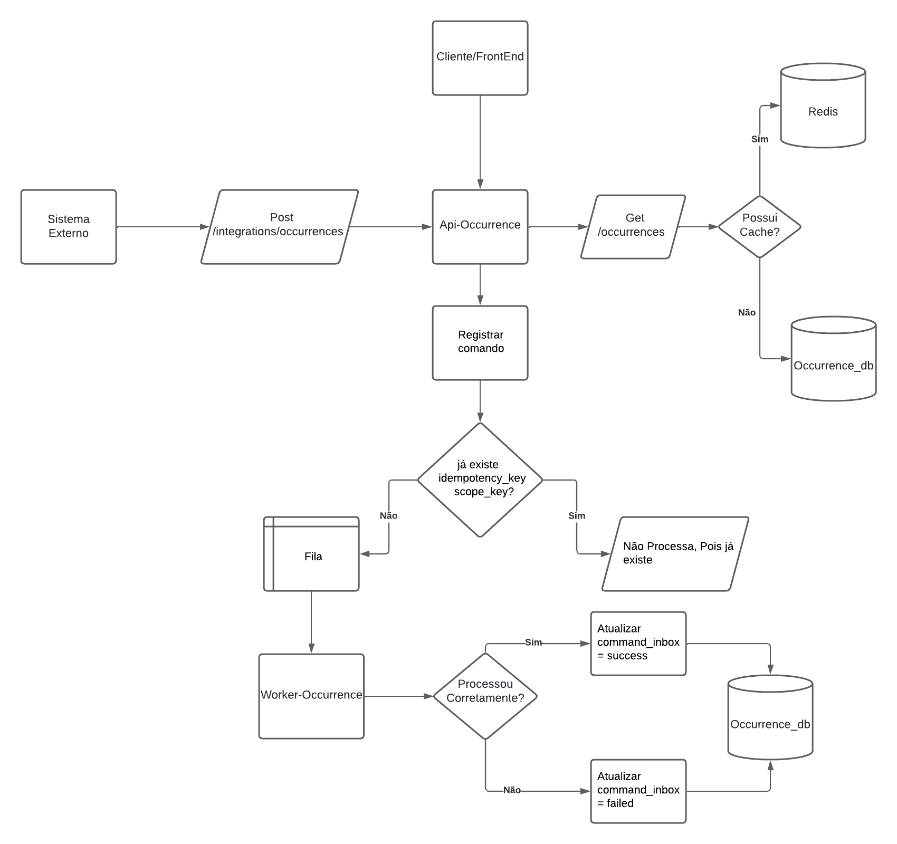

# Prova Bomb - Sistema de Gerenciamento de Ocorrências

## 1. Como Rodar Backend e Frontend

### Pré-requisitos

Antes de iniciar o projeto, certifique-se de ter instalado:

- **Docker** (versão 20.10 ou superior)
  - **Docker Compose** (versão 2.0 ou superior)
  - **Node.js** (versão 18 ou superior)
  - **npm** (versão 9 ou superior)
  - **Make** (necessário para executar os comandos)

### Como Rodar

O projeto possui um `Makefile` na raiz que automatiza todo o processo de inicialização.

#### Iniciar todos os serviços

```bash
make up BASE_DIR= # Diretorio desejado
```

Este comando irá:
1. Criar a rede Docker `internal` (se não existir)
   2. Iniciar a API (porta 8089)
   3. Iniciar o Worker (porta 8014)
   4. Iniciar o Frontend (porta 3000)

#### Comandos úteis do Makefile

```bash
# Ver todos os comandos disponíveis
make help

# Criar apenas a rede Docker
make network

# Iniciar apenas a API
make api BASE_DIR=/diretorio/desejado

# Iniciar apenas o Worker
make worker BASE_DIR=/diretorio/desejado

# Iniciar apenas o Frontend
make frontend

# Iniciar tudo (API + Worker + Frontend)
make up BASE_DIR=/diretorio/desejado

# Setup completo da API (.env + composer + key + migrate + seed + swagger)
make setup-api

# Rodar migrations da API
make migrate-api

# Rodar seeds da API
make seed-api

# Gerar documentação Swagger da API
make swagger-api

# Entrar no container da API
make bash-api

# Entrar no container do Worker
make bash-worker

# Parar todos os serviços Docker
make down BASE_DIR=/diretorio/desejado

# Parar serviços sem remover containers
make stop BASE_DIR=/diretorio/desejado

# Reiniciar todos os serviços
make restart BASE_DIR=/diretorio/desejado

# Ver logs da API
make logs-api

# Ver logs do Worker
make logs-worker

# Limpar tudo (containers, volumes e rede)
make clean
```

### Estrutura de Portas

| Serviço | Porta | Descrição |
|---------|-------|-----------|
| API HTTP | 8089 | API principal |
| Worker HTTP | 8014 | Worker HTTP |
| PostgreSQL | 5433 | Banco de dados |
| Redis | 6379 | Cache e sessões |
| RabbitMQ AMQP | 5672 | Mensageria |
| RabbitMQ Management | 15672 | Interface web do RabbitMQ |

---

## 2. Desenho de Arquitetura

### Visão Geral do Sistema

O sistema é composto por componentes que trabalham em conjunto para gerenciar ocorrências, garantindo idempotência, processamento assíncrono e otimização através de cache.

### Diagrama de Arquitetura



---

## 3. Estratégia de Integração Externa

A integração externa foi desenhada para ser segura, resiliente e escalável. Optamos por um modelo baseado em **API REST** com processamento assíncrono, separando claramente o momento de recebimento da requisição do momento de processamento da regra de negócio.

### Princípios da Estratégia

- **API recebe, valida e registra o comando**: O processamento ocorre de forma desacoplada via fila
- **Melhor desempenho**: API responde rapidamente (202 Accepted) sem bloquear
- **Maior confiabilidade**: Falhas no processamento não afetam a resposta da API
- **Controle de falhas**: Comandos são rastreados e podem ser reprocessados

### Fluxo de Integração

1. **Sistema Externo** envia requisição com `Idempotency-Key`
2. **API** valida autenticação, rate limit e payload
3. **API** registra comando no `command_inbox` (status: `pending`)
4. **API** envia comando para fila RabbitMQ
5. **API** retorna `202 Accepted` com `command_id`
6. **Worker** processa comando assincronamente
7. **Worker** atualiza status no `command_inbox` (`success` ou `failed`)

---

## 4. Estratégia de Idempotência

A idempotência é **obrigatória** na criação de ocorrências e em todas as operações de escrita.

### Requisitos

- Toda requisição precisa enviar uma `Idempotency-Key` no header
- O sistema registra o comando na tabela `command_inbox` antes de qualquer processamento

### Comportamento

Se a mesma chave for enviada novamente:

- ✅ O comando **não é processado duas vezes**
- ✅ O sistema retorna o status já existente
- ✅ Evita duplicação de dados

### Proteções

Isso protege contra:

- **Retries automáticos**: Cliente pode reenviar sem criar duplicatas
- **Timeouts de rede**: Requisição pode ser reenviada com segurança
- **Requisições duplicadas**: Múltiplas requisições simultâneas são tratadas como uma

### Controle de Idempotência

O controle é feito com base na combinação de:

- `idempotency_key`: Chave única fornecida pelo cliente
- `scope_key`: Contexto da idempotência (geralmente o `externalId`)
- `type`: Tipo do comando (ex: `create_occurrence`)

**Validação de Payload Diferente:**

Se a mesma `idempotency_key` + `scope_key` for usada com payload diferente, o sistema retorna `409 Conflict` para evitar inconsistências.

---

## 5. Estratégia de Concorrência

Para evitar condições de corrida (race conditions), o sistema utiliza múltiplas camadas de proteção.

### Mecanismos Implementados

#### 1. Transações de Banco

Todas as operações críticas executam dentro de transações atômicas:

```php
DB::transaction(function () {
    // Operações atômicas
});
```

#### 2. Lock Pessimista (lockForUpdate)

Uso de `lockForUpdate()` para serializar operações concorrentes:

- **No Command Inbox**: Garante que apenas uma requisição registra o comando
- **Nas Entidades**: Garante que apenas um worker processa a mesma entidade por vez

```php
CommandInboxModel::query()
    ->where('idempotency_key', $key)
    ->where('scope_key', $scope)
    ->lockForUpdate()  // ← Lock pessimista
    ->first();
```

#### 3. Registro Prévio do Comando

O comando é registrado no `command_inbox` **antes** do envio à fila:

- Garante rastreabilidade mesmo se a fila falhar
- Permite verificação de duplicatas antes do processamento
- Evita processamento duplicado em cenários de concorrência

#### 4. Validação de Estado no Worker

O worker também valida o status antes de processar:

- Verifica se o comando já foi processado
- Valida transições de estado permitidas
- Evita reprocessamento indevido

### Garantias

Isso garante que:

- ✅ Duas requisições simultâneas com a mesma chave não criam comandos duplicados
- ✅ Apenas um worker processa a mesma entidade por vez
- ✅ Transições de estado inválidas são bloqueadas
- ✅ Consistência de dados mesmo em alta concorrência

---

## 6. Pontos de Falha e Recuperação

O sistema foi projetado para ser resiliente, considerando os principais pontos de falha e suas estratégias de recuperação.

### 1. Falha na API

**Cenário**: API falha antes de registrar o comando

**Comportamento**:
- Nada é persistido no banco de dados
- Cliente recebe erro (500, 503, etc.)

**Recuperação**:
- Cliente pode reenviar a requisição com a mesma `Idempotency-Key`
- Sistema processará normalmente (não há duplicação)

### 2. Falha após Registro, antes do Envio à Fila

**Cenário**: Comando registrado como `pending`, mas falha ao enviar para fila

**Comportamento**:
- Comando fica registrado no `command_inbox` com status `pending`
- Cliente recebeu `202 Accepted` com `command_id`

**Recuperação**:
- Comando pode ser reenviado manualmente para a fila
- Sistema pode implementar job de recuperação para reprocessar `pending` antigos
- Cliente pode consultar status via `GET /api/commands/{command_id}`

### 3. Falha no Worker

**Cenário**: Processamento do comando falha no worker

**Comportamento**:
- Status é atualizado para `failed` no `command_inbox`
- Erro é registrado no campo `error_message`
- Comando é movido para `failed_jobs` (DLQ do Laravel) após retries

**Recuperação**:
- Comando pode ser reprocessado posteriormente (retry manual)
- Comandos com status `failed` permitem retry com mesma `Idempotency-Key`
- Administrador pode analisar erros e corrigir antes de reprocessar

### 4. Falha na Fila

**Cenário**: RabbitMQ indisponível ou fila cheia

**Comportamento**:
- Como o registro acontece **antes** do envio à fila, o sistema mantém rastreabilidade
- Comando fica como `pending` no `command_inbox`
- API pode retornar erro ou aceitar e processar quando fila voltar

**Recuperação**:
- Quando fila voltar, comandos `pending` podem ser reenviados
- Sistema pode implementar retry automático para comandos `pending` antigos
- Rastreabilidade completa mantida mesmo em falhas de infraestrutura

### 5. Falha no Banco de Dados

**Cenário**: PostgreSQL indisponível

**Comportamento**:
- Operações de escrita falham
- API retorna erro 503 (Service Unavailable)

**Recuperação**:
- Cliente pode retentar após intervalo
- Sistema deve implementar health checks e circuit breakers
- Backup e replicação garantem disponibilidade

### Estratégias de Resiliência

- **Idempotência**: Permite retries seguros
- **Rastreabilidade**: Todos os comandos são registrados
- **Desacoplamento**: API não depende do processamento
- **DLQ Dupla**: `command_inbox` (negócio) + `failed_jobs` (infraestrutura)
- **Locks Pessimistas**: Previnem condições de corrida

---

## 7. O que ficou de fora

Para manter a solução viável no contexto atual, não foram implementados os seguintes itens:

### Funcionalidades não Implementadas

#### Dead Letter Queue Dedicada

- **Status**: Parcialmente implementado
- **O que existe**: `command_inbox` (status `failed`) e `failed_jobs` (Laravel)
- **O que falta**: DLQ estruturada no RabbitMQ com reprocessamento automático

#### Retry Automático com Backoff Exponencial no Worker

- **Status**: Não implementado
- **O que existe**: Retry do Laravel (configurável, mas não exponencial)
- **O que falta**: Retry automático com backoff exponencial para comandos `failed`

#### Observabilidade Avançada

- **Status**: Parcialmente implementado
- **O que existe**: Logs estruturados com contexto
- **O que falta**: 
  - Métricas distribuídas (Prometheus/Grafana)
  - Distributed Tracing (OpenTelemetry)
  - Correlation-ID único por requisição
  - Dashboards de monitoramento

#### Circuit Breaker para Integrações Externas

- **Status**: Não implementado
- **O que falta**: Proteção contra cascata de falhas em integrações externas

### Justificativa

Esses pontos podem ser evoluídos conforme o sistema cresça e as necessidades aumentem. A arquitetura atual permite adicionar essas funcionalidades sem grandes refatorações.

---

## 8. Possível Evolução na Corporação

Em um cenário corporativo maior, o sistema poderia evoluir para as seguintes melhorias:

### Arquitetura e Padrões

#### Separação Formal entre Write Model e Read Model (CQRS Completo)

- **Benefício**: Otimização de leitura e escrita independentes
- **Implementação**: Modelos de leitura otimizados em Redis/Elasticsearch
- **Impacto**: Melhor performance em consultas complexas

#### Event Sourcing para Rastreabilidade Histórica

- **Benefício**: Histórico completo e imutável de todas as mudanças
- **Implementação**: Armazenar eventos ao invés de estado atual
- **Impacto**: Auditoria completa e possibilidade de reconstruir estado em qualquer ponto

### Observabilidade e Monitoramento

#### Monitoramento com Métricas (Prometheus / Grafana)

- **Benefício**: Visibilidade completa do sistema em tempo real
- **Implementação**: 
  - Exportar métricas para Prometheus
  - Dashboards no Grafana
  - Alertas configuráveis
- **Impacto**: Detecção proativa de problemas

### Infraestrutura e Mensageria

#### Dead Letter Queue Estruturada

- **Benefício**: Reprocessamento automático e análise de falhas
- **Implementação**: DLQ no RabbitMQ com workers dedicados
- **Impacto**: Recuperação automática de falhas temporárias

#### API Gateway Centralizado

- **Benefício**: Gerenciamento unificado de APIs
- **Implementação**: Kong, AWS API Gateway, ou similar
- **Impacto**: 
  - Rate limiting centralizado
  - Autenticação unificada
  - Roteamento inteligente
  - Analytics centralizado

### Segurança e Autenticação

#### Autenticação via OAuth2 / JWT ao invés de API Key

- **Benefício**: Segurança mais robusta e flexível
- **Implementação**: 
  - OAuth2 para sistemas externos
  - JWT para autenticação interna
  - Refresh tokens
- **Impacto**: Melhor controle de acesso e auditoria

### Escalabilidade

#### Autoscaling Horizontal de Workers

- **Benefício**: Escalabilidade automática baseada em carga
- **Implementação**: 
  - Kubernetes com HPA (Horizontal Pod Autoscaler)
  - Métricas de fila como trigger
- **Impacto**: Resposta automática a picos de demanda
