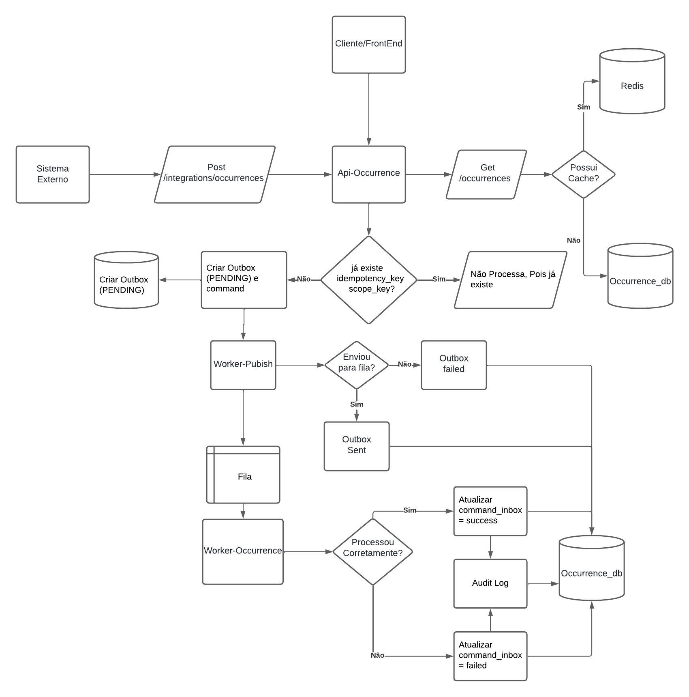

# Prova Bomb - Sistema de Gerenciamento de Ocorrências

## 1. Como Rodar Backend e Frontend

### Ambiente Recomendado

Para evitar problemas de compatibilidade e permissões, recomenda-se executar todo o projeto em um ambiente Linux (Ubuntu 22.04 ou superior).

> Embora seja possível rodar no Windows ou macOS, o ambiente Ubuntu oferece maior estabilidade com Docker, Make e Node.js.

O ideal é:

- Clonar o projeto diretamente no Ubuntu
- Ter o Node.js instalado no Ubuntu
- Executar o make diretamente no terminal do Ubuntu
- Utilizar Docker Desktop (ou Docker Engine) instalado no Ubuntu

### Pré-requisitos

Antes de iniciar o projeto, certifique-se de ter instalado:

- **Docker** (versão 20.10 ou superior)
  - **Docker Compose** (versão 2.0 ou superior)
  - **Node.js** (versão 18 ou superior)
  - **npm** (versão 9 ou superior)
  - **Make** (necessário para executar os comandos)

### Como Rodar

O projeto possui um `Makefile` na raiz que automatiza todo o processo de inicialização.

#### Iniciar todos os serviços

```bash
make up BASE_DIR= # Diretorio desejado
```

Este comando irá:
  1. Iniciar a API (porta 8089)
  2. Iniciar o Worker-Occurrence (porta 8014)
  3. Iniciar o Worker-Publish (porta 8015)
  4. Iniciar o Frontend (porta 3000)

#### Comandos úteis do Makefile

```bash
# Ver todos os comandos disponíveis
make help

# Iniciar apenas a API
make api BASE_DIR=/diretorio/desejado

# Iniciar apenas o Worker-Occurrence
make worker BASE_DIR=/diretorio/desejado

# Iniciar apenas o Worker-Publish
make worker-publish BASE_DIR=/diretorio/desejado

# Iniciar apenas o Frontend
make frontend

# Iniciar tudo (API + Worker-Occurrence + Worker-Publish + Frontend)
make up BASE_DIR=/diretorio/desejado

# Setup completo da API (.env + composer + key + migrate + seed + swagger)
make setup-api

# Rodar migrations da API
make migrate-api

# Rodar seeds da API
make seed-api

# Gerar documentação Swagger da API
make swagger-api

# Entrar no container da API
make bash-api

# Entrar no container do Worker-Occurrence
make bash-worker

# Entrar no container do Worker-Publish
make bash-worker-publish

# Parar todos os serviços Docker
make down BASE_DIR=/diretorio/desejado

# Parar serviços sem remover containers
make stop BASE_DIR=/diretorio/desejado

# Reiniciar todos os serviços
make restart BASE_DIR=/diretorio/desejado

# Ver logs da API
make logs-api

# Ver logs do Worker-Occurrence
make logs-worker

# Ver logs do Worker-Publish
make logs-worker-publish

# Limpar tudo (containers, volumes e rede)
make clean
```

### Estrutura de Portas

| Serviço | Porta | Descrição |
|---------|-------|-----------|
| API HTTP | 8089 | API principal |
| Worker-Occurrence HTTP | 8014 | Worker de processamento de ocorrências |
| Worker-Publish HTTP | 8015 | Worker de publicação de eventos (Outbox) |
| PostgreSQL | 5433 | Banco de dados |
| Redis | 6379 | Cache e sessões |
| RabbitMQ AMQP | 5672 | Mensageria |
| RabbitMQ Management | 15672 | Interface web do RabbitMQ |

---

## 2. Desenho de Arquitetura

### Visão Geral do Sistema

O sistema é composto por componentes que trabalham em conjunto para gerenciar ocorrências, garantindo idempotência, processamento assíncrono e otimização através de cache. Utiliza o padrão **Outbox** para garantir publicação atômica de eventos na fila de mensageria.

### Diagrama de Arquitetura



---

## 3. Estratégia de Integração Externa

A integração externa foi desenhada para ser segura, resiliente e escalável. Optamos por um modelo baseado em **API REST** com processamento assíncrono, separando claramente o momento de recebimento da requisição do momento de processamento da regra de negócio.

### Princípios da Estratégia

- **API recebe, valida e registra o comando**: O processamento ocorre de forma desacoplada via fila
- **Padrão Outbox**: Eventos são registrados na tabela `outbox` antes da publicação na fila, garantindo atomicidade
- **Melhor desempenho**: API responde rapidamente (202 Accepted) sem bloquear
- **Maior confiabilidade**: Falhas no processamento não afetam a resposta da API
- **Controle de falhas**: Comandos são rastreados e podem ser reprocessados

### Fluxo de Integração

1. **Sistema Externo** envia requisição com `X-API-Key` e `Idempotency-Key`
2. **API** valida autenticação, rate limit, idempotência e payload
3. **API** registra comando no `command_inbox` (status: `RECEIVED`) com lock pessimista
4. **API** registra evento na tabela `outbox` (status: `PENDING`) - **Padrão Outbox**
5. **API** retorna `202 Accepted` com `command_id`
6. **Worker-Publish** processa eventos `PENDING` da tabela `outbox` periodicamente
7. **Worker-Publish** busca comando no `command_inbox` e publica Job na fila RabbitMQ
8. **Worker-Publish** marca evento como `SENT` na tabela `outbox`
9. **Worker-Occurrence** consome job da fila, revalida idempotência e processa comando assincronamente
10. **Worker-Occurrence** atualiza status no `command_inbox` (`PROCESSING`, `SUCCEEDED` ou `FAILED`)

---

## 4. Padrão Outbox

O sistema utiliza o padrão **Outbox** para garantir publicação atômica de eventos na fila de mensageria, resolvendo o problema de consistência entre transações de banco de dados e publicação de mensagens.

### Por que Outbox?

Sem o padrão Outbox, há risco de inconsistência:
- Se a API registrar o comando no banco e falhar ao publicar na fila, o comando fica "perdido"
- Se a API publicar na fila e falhar ao registrar no banco, há duplicação ou inconsistência

### Como Funciona

1. **Registro Atômico**: API registra comando no `command_inbox` e evento na `outbox` na mesma transação
2. **Publicação Assíncrona**: Worker-Outbox processa eventos `PENDING` da tabela `outbox` periodicamente
3. **Publicação na Fila**: Worker-Outbox busca comando completo e publica Job na fila RabbitMQ
4. **Rastreabilidade**: Todos os eventos são rastreados na tabela `outbox` antes e depois da publicação

### Estados da Outbox

- **PENDING**: Evento aguardando publicação na fila
- **PROCESSING**: Evento sendo processado pelo Worker-Outbox (lock ativo)
- **SENT**: Evento publicado com sucesso na fila RabbitMQ
- **FAILED**: Falha definitiva na publicação (ex: comando não encontrado, event_type não suportado)

### Benefícios

- ✅ **Atomicidade**: Comando e evento registrados na mesma transação
- ✅ **Rastreabilidade**: Todos os eventos são rastreados antes da publicação
- ✅ **Resiliência**: Falhas na publicação não perdem eventos
- ✅ **Reprocessamento**: Eventos `PENDING` são reprocessados automaticamente
- ✅ **Concorrência**: Múltiplas instâncias do Worker-Outbox podem processar eventos diferentes simultaneamente

### Worker-Publish

O Worker-Publish é responsável por:
- Processar eventos `PENDING` da tabela `outbox` (execução a cada minuto)
- Buscar comandos completos no `command_inbox` usando `aggregate_id`
- Mapear `event_type` para `commandType` e classe de Job
- Publicar Jobs na fila RabbitMQ
- Gerenciar estados dos eventos na `outbox`

---

## 5. Estratégia de Idempotência

A idempotência é **obrigatória** na criação de ocorrências e em todas as operações de escrita.

### Requisitos

- Toda requisição de escrita (POST, PUT, PATCH) precisa enviar uma `Idempotency-Key` no header
- O sistema registra o comando na tabela `command_inbox` antes de qualquer processamento
- **Todas as rotas de escrita já possuem middleware** que valida e exige `Idempotency-Key`:
  - `POST /api/integrations/occurrences` (integração externa)
  - `POST /api/occurrences/{id}/start`
  - `POST /api/occurrences/{id}/resolve`
  - `POST /api/occurrences/{id}/dispatches`
  - `POST /api/dispatches/{id}/close`
  - `PATCH /api/dispatches/{id}/status`
- O frontend React envia automaticamente `Idempotency-Key` via interceptor Axios em todas as requisições POST/PUT/PATCH

### Comportamento

Se a mesma chave for enviada novamente:

- ✅ O comando **não é processado duas vezes**
- ✅ O sistema retorna o status já existente
- ✅ Evita duplicação de dados

### Proteções

Isso protege contra:

- **Retries automáticos**: Cliente pode reenviar sem criar duplicatas
- **Timeouts de rede**: Requisição pode ser reenviada com segurança
- **Requisições duplicadas**: Múltiplas requisições simultâneas são tratadas como uma

### Controle de Idempotência

O controle é feito com base na combinação de:

- `idempotency_key`: Chave única fornecida pelo cliente
- `scope_key`: Contexto da idempotência (geralmente o `externalId`)
- `type`: Tipo do comando (ex: `create_occurrence`)

**Validação de Payload Diferente:**

Se a mesma `idempotency_key` + `scope_key` for usada com payload diferente, o sistema retorna `409 Conflict` para evitar inconsistências.

**Validações de Negócio Adicionais:**

- Criação de despacho valida que não existe outro despacho com o mesmo `resource_code` na mesma ocorrência (lança `DomainException`).
- Transições de status são validadas no domínio (ex.: não é possível resolver ocorrência já cancelada).

---

## 6. Estratégia de Concorrência

Para evitar condições de corrida (race conditions), o sistema utiliza múltiplas camadas de proteção.

### Mecanismos Implementados

#### 1. Transações de Banco

Todas as operações críticas executam dentro de transações atômicas:

```php
DB::transaction(function () {
    // Operações atômicas
});
```

#### 2. Lock Pessimista (lockForUpdate)

Uso de `lockForUpdate()` para serializar operações concorrentes:

- **No Command Inbox**: Garante que apenas uma requisição registra o comando
- **Nas Entidades**: Garante que apenas um Worker-Occurrence processa a mesma entidade por vez

```php
CommandInboxModel::query()
    ->where('idempotency_key', $key)
    ->where('scope_key', $scope)
    ->lockForUpdate()  // ← Lock pessimista
    ->first();
```

#### 3. Padrão Outbox

O sistema utiliza o padrão **Outbox** para garantir publicação atômica de eventos:

- **Registro na tabela `outbox`**: Eventos são registrados na tabela `outbox` (status: `PENDING`) dentro da mesma transação do `command_inbox`
- **Publicação assíncrona**: Worker-Publish processa eventos `PENDING` periodicamente e publica na fila
- **Atomicidade**: Se a publicação na fila falhar, o evento permanece `PENDING` e será reprocessado
- **Rastreabilidade**: Todos os eventos são rastreados na tabela `outbox` antes da publicação

#### 4. Registro Prévio do Comando

O comando é registrado no `command_inbox` **antes** do envio à fila:

- Garante rastreabilidade mesmo se a fila falhar
- Permite verificação de duplicatas antes do processamento
- Evita processamento duplicado em cenários de concorrência

#### 5. Validação de Estado no Worker

O Worker-Occurrence também valida o status antes de processar:

- Verifica se o comando já foi processado
- Valida transições de estado permitidas
- Evita reprocessamento indevido

#### 6. Lock no Worker-Publish

O Worker-Publish utiliza `FOR UPDATE SKIP LOCKED` para processar eventos:

- Múltiplas instâncias podem processar eventos diferentes simultaneamente
- Cada evento é processado apenas uma vez
- Lock ativo durante o processamento evita duplicação

### Garantias

Isso garante que:

- ✅ Duas requisições simultâneas com a mesma chave não criam comandos duplicados
- ✅ Apenas um Worker-Occurrence processa a mesma entidade por vez
- ✅ Transições de estado inválidas são bloqueadas
- ✅ Consistência de dados mesmo em alta concorrência

---

## 7. Pontos de Falha e Recuperação

O sistema foi projetado para ser resiliente, considerando os principais pontos de falha e suas estratégias de recuperação.

### 1. Falha na API

**Cenário**: API falha antes de registrar o comando

**Comportamento**:
- Nada é persistido no banco de dados
- Cliente recebe erro (500, 503, etc.)

**Recuperação**:
- Cliente pode reenviar a requisição com a mesma `Idempotency-Key`
- Sistema processará normalmente (não há duplicação)

### 2. Falha após Registro, antes do Registro na Outbox

**Cenário**: Comando registrado no `command_inbox`, mas falha ao registrar na `outbox`

**Comportamento**:
- Transação é revertida (rollback)
- Nada é persistido no banco de dados
- Cliente recebe erro (500, 503, etc.)

**Recuperação**:
- Cliente pode reenviar a requisição com a mesma `Idempotency-Key`
- Sistema processará normalmente (não há duplicação)

### 3. Falha no Worker-Publish

**Cenário**: Worker-Publish não consegue publicar evento na fila

**Comportamento**:
- Evento fica na tabela `outbox` com status `PENDING` ou `PROCESSING`
- Comando fica no `command_inbox` com status `RECEIVED`
- Cliente já recebeu `202 Accepted` com `command_id`

**Recuperação**:
- Worker-Publish reprocessa eventos `PENDING` automaticamente (execução a cada minuto)
- Eventos `PROCESSING` antigos podem ser resetados para `PENDING` manualmente
- Falhas temporárias (ex: RabbitMQ indisponível) são tratadas automaticamente
- Falhas definitivas (ex: comando não encontrado) marcam evento como `FAILED` na `outbox`

### 4. Falha no Worker-Occurrence

**Cenário**: Processamento do comando falha no Worker-Occurrence

**Comportamento**:
- Status é atualizado para `FAILED` no `command_inbox`
- Erro é registrado no campo `error_message`
- Comando é movido para `failed_jobs` (DLQ do Laravel) após retries

**Recuperação**:
- Comando pode ser reprocessado posteriormente (retry manual)
- Comandos com status `FAILED` permitem retry com mesma `Idempotency-Key`
- Administrador pode analisar erros e corrigir antes de reprocessar

### 5. Falha na Fila (RabbitMQ)

**Cenário**: RabbitMQ indisponível ou fila cheia

**Comportamento**:
- Eventos ficam na tabela `outbox` com status `PENDING` ou `PROCESSING`
- Comando fica no `command_inbox` com status `RECEIVED`
- Worker-Publish detecta falha temporária e marca evento como `PENDING` novamente

**Recuperação**:
- Quando RabbitMQ voltar, Worker-Publish reprocessa eventos `PENDING` automaticamente
- Sistema mantém rastreabilidade completa na tabela `outbox`
- Não há perda de eventos mesmo em falhas de infraestrutura

### 6. Falha no Banco de Dados

**Cenário**: PostgreSQL indisponível

**Comportamento**:
- Operações de escrita falham
- API retorna erro 503 (Service Unavailable)
- Worker-Publish não consegue ler eventos da `outbox`

**Recuperação**:
- Cliente pode retentar após intervalo
- Worker-Publish retenta automaticamente quando banco voltar
- Sistema deve implementar health checks e circuit breakers
- Backup e replicação garantem disponibilidade

### Estratégias de Resiliência

- **Idempotência**: Permite retries seguros
- **Padrão Outbox**: Garante publicação atômica de eventos na fila
- **Rastreabilidade**: Todos os comandos e eventos são registrados
- **Desacoplamento**: API não depende do processamento
- **DLQ Tripla**: `outbox` (status `FAILED`) + `command_inbox` (status `FAILED`) + `failed_jobs` (infraestrutura)
- **Locks Pessimistas**: Previnem condições de corrida
- **Processamento Assíncrono**: Worker-Publish processa eventos independentemente da API

---

## 8. O que ficou de fora

Para manter a solução viável no contexto atual, não foram implementados os seguintes itens:

### Funcionalidades não Implementadas

#### Limpeza Automática de Comandos Expirados

- **Status**: Não implementado
- **O que existe**: Limpeza de comandos expirados foi removida do fluxo principal de processamento (otimização de performance)
- **O que falta**: 
  - Comando de limpeza agendado (`command-inbox:cleanup-expired`)
  - Processo dedicado para executar limpeza periódica (cron job ou scheduler dedicado)
  - Limpeza automática de registros com `expires_at` vencido na tabela `command_inbox`
- **Justificativa**: A limpeza foi removida do fluxo principal para evitar locks e custo desnecessário. Pode ser implementada como processo separado quando necessário.

#### Dead Letter Queue Dedicada

- **Status**: Parcialmente implementado
- **O que existe**: `command_inbox` (status `failed`) e `failed_jobs` (Laravel)
- **O que falta**: DLQ estruturada no RabbitMQ com reprocessamento automático

#### Retry Automático com Backoff Exponencial no Worker-Occurrence

- **Status**: Não implementado
- **O que existe**: Retry do Laravel (configurável, mas não exponencial)
- **O que falta**: Retry automático com backoff exponencial para comandos `FAILED`

#### Observabilidade Avançada

- **Status**: Parcialmente implementado
- **O que existe**: Logs estruturados com contexto
- **O que falta**: 
  - Métricas distribuídas (Prometheus/Grafana)
  - Distributed Tracing (OpenTelemetry)
  - Correlation-ID único por requisição
  - Dashboards de monitoramento

#### Circuit Breaker para Integrações Externas

- **Status**: Não implementado
- **O que falta**: Proteção contra cascata de falhas em integrações externas

### Justificativa

Esses pontos podem ser evoluídos conforme o sistema cresça e as necessidades aumentem. A arquitetura atual permite adicionar essas funcionalidades sem grandes refatorações.

---

## 9. Possível Evolução na Corporação

Em um cenário corporativo maior, o sistema poderia evoluir para as seguintes melhorias:

### Arquitetura e Padrões

#### Separação Formal entre Write Model e Read Model (CQRS Completo)

- **Benefício**: Otimização de leitura e escrita independentes
- **Implementação**: Modelos de leitura otimizados em Redis/Elasticsearch
- **Impacto**: Melhor performance em consultas complexas

#### Event Sourcing para Rastreabilidade Histórica

- **Benefício**: Histórico completo e imutável de todas as mudanças
- **Implementação**: Armazenar eventos ao invés de estado atual
- **Impacto**: Auditoria completa e possibilidade de reconstruir estado em qualquer ponto

### Observabilidade e Monitoramento

#### Monitoramento com Métricas (Prometheus / Grafana)

- **Benefício**: Visibilidade completa do sistema em tempo real
- **Implementação**: 
  - Exportar métricas para Prometheus
  - Dashboards no Grafana
  - Alertas configuráveis
- **Impacto**: Detecção proativa de problemas

### Infraestrutura e Mensageria

#### Limpeza Automática de Comandos Expirados

- **Benefício**: Manutenção automática do banco de dados, removendo registros antigos
- **Implementação**: 
  - Comando de limpeza (`command-inbox:cleanup-expired`)
  - Processo dedicado (cron job ou scheduler) para execução periódica
  - Configuração de TTL e frequência de limpeza
- **Impacto**: 
  - Redução do tamanho da tabela `command_inbox`
  - Melhor performance em consultas
  - Manutenção automatizada sem intervenção manual

#### Dead Letter Queue Estruturada

- **Benefício**: Reprocessamento automático e análise de falhas
- **Implementação**: DLQ no RabbitMQ com workers dedicados
- **Impacto**: Recuperação automática de falhas temporárias

#### API Gateway Centralizado

- **Benefício**: Gerenciamento unificado de APIs
- **Implementação**: Kong, AWS API Gateway, ou similar
- **Impacto**: 
  - Rate limiting centralizado
  - Autenticação unificada
  - Roteamento inteligente
  - Analytics centralizado

### Segurança e Autenticação

#### Autenticação via OAuth2 / JWT ao invés de API Key

- **Benefício**: Segurança mais robusta e flexível
- **Implementação**: 
  - OAuth2 para sistemas externos
  - JWT para autenticação interna
  - Refresh tokens
- **Impacto**: Melhor controle de acesso e auditoria

### Escalabilidade

#### Autoscaling Horizontal de Workers

- **Benefício**: Escalabilidade automática baseada em carga
- **Implementação**: 
  - Kubernetes com HPA (Horizontal Pod Autoscaler)
  - Métricas de fila como trigger para Worker-Occurrence
  - Métricas de `outbox` (eventos `PENDING`) como trigger para Worker-Publish
- **Impacto**: Resposta automática a picos de demanda
